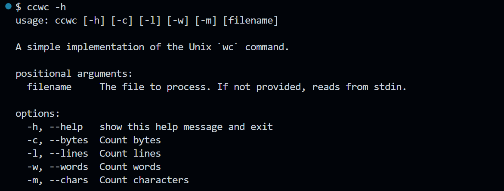

# CCWC (Coding Challenge Word Count (WC))

`ccwc` is a command-line tool for counting chars, words, lines in a file or from standard input.

Simple implementation inspired by the Unix `wc`(word count) command.

Thanks to John Crickett for his [Coding Challenge](https://codingchallenges.substack.com/p/coding-challenge-1)

## How to install?
```bash
# Clone Repo
git clone https://github.com/VaishnavSherla/ccwc
cd ccwc

# Remove Old Artifacts
rm -rf build dist *.egg-info

# Build Package
python setup.py sdist bdist_wheel

# Install Package
pip install .

# Verify Installation
where ccwc   # On Windows
which ccwc   # On Unix-like systems

# Run Anywhere on your local system 
ccwc test.txt
```

## Screenshots




